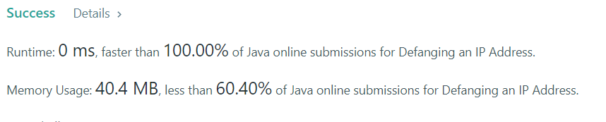

# Defanging an IP Address

### Task:

    Given a valid (IPv4) IP address, return a defanged version of that IP address.
    A defanged IP address replaces every period "." with "[.]".

### Example 1:

    Input: address = "1.1.1.1"
    Output: "1[.]1[.]1[.]1"

### Example 2:

    Input: address = "255.100.50.0"
    Output: "255[.]100[.]50[.]0"

### Result:

    The time complexity of this algorithm is O(1). And the same algorithm for memory.
